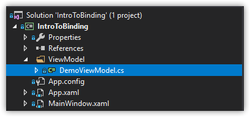
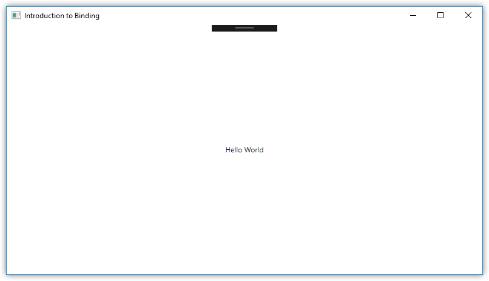

# Project 0: Binding 101, or Introduction to Binding

The core takeaway of MVVM is that by expending effort early on by splitting your application into independent parts, you make it easier for yourself and others in the future to modify the visual appearance or the underlying logic of your application. For me, a massive hurdle in learning MVVM was being able to connect the dots from a rudimentary example to a small application with several moving parts.

At an absolutely basic level, a WPF MVVM application can be broken into just two parts: a View and a ViewModel. The view is what the user of the program will see on their monitor, while the ViewModel is where most of the code-based magic takes place. Don't worry about Models just yet; MVVM wouldn't be complete without them, but for the utmost barebones example, we only need a View and a ViewModel.

## Lay The Foundation: Create a View and a ViewModel

Start out by creating a new WPF project in Visual Studio and call it `IntroToBinding`. Once Visual Studio finishes setting up the project, open the `MainWindow.xaml` file and add a `<TextBlock>` to the `<Grid>` of the `MainWindow` file:

```xml
<Grid>
    <TextBlock HorizontalAlignment="Center" VerticalAlignment="Center" Text="Hello World" />
</Grid>
```

Once you've got that added, build the project. If it builds successfully, run it in debug mode to verify that the GUI that pops up has the words "Hello World" in the center. If it runs successfully, you're good to go; always good to make sure.

Now you'll add an accompanying ViewModel to the application. Create a new folder in the project and name it `ViewModel`; as you might have guessed, the ViewModel will call this folder home. Something you should get into the habit of doing is creating explicit folders for where your code will live, as it will strengthen the "separation of concerns" idea behind MVVM in your mind.

Next, create a class in that folder called `DemoViewModel`. Your directory structure should look like the image below



If your solution explorer structure matches up, open up the class you just created and make sure that this class implements the `INotifyPropertyChanged` interface.

```csharp
public class DemoViewModel : INotifyPropertyChanged
{

}
```

Of course, it's no good to attach an interface to a class and not implement it, so you'll need to build this out. Start by adding a private field for some text:

```csharp
public class DemoViewModel : INotifyPropertyChanged
{
    private string _text;
}
```

Then create a public field named `PropertyChanged`. If you let Visual Studio implement the interface for you, it will create the following:

```csharp
using System.ComponentModel;

public class DemoViewModel : INotifyPropertyChanged
{
    private string _text;

    public event PropertyChangedEventHandler PropertyChanged;
}
```

Add a constructor...

```csharp
using System.ComponentModel;

public class DemoViewModel : INotifyPropertyChanged
{
    private string _text;

    public event PropertyChangedEventHandler PropertyChanged;

    public DemoViewModel
    {

    }
}
```

In order to fully implement the `INotifyPropertyChanged` interface, you'll need to create a method called `OnPropertyChanged`.

```csharp
using System.ComponentModel;
using System.Runtime.CompilerServices;

public class DemoViewModel : INotifyPropertyChanged
{
    private string _text;

    public event PropertyChangedEventHandler PropertyChanged;

    public DemoViewModel()
    {

    }

    // [CallerMemberName] allows for some more robust code later on
    protected virtual void OnPropertyChanged([CallerMemberName] string propertyName = null)
    {
        PropertyChanged?.Invoke(this, new PropertyChangedEventArgs(propertyName));
    }
}
```

Implementing this method (and in turn, the rest of the `INotifyPropertyChanged` interface) allows the bindings you define in your XAML to stay synchronized with any C# class the interface happens to be implemented on  [(Erik Dietrich, 2011)](https://daedtech.com/wpf-and-notifying-property-change/).

Finally, you'll need to create a property that leverages the `OnPropertyChanged` method.

```csharp
using System.ComponentModel;
using System.Runtime.CompilerServices;

public class DemoViewModel : INotifyPropertyChanged
{
    private string _text;

    public event PropertyChangedEventHandler PropertyChanged;

    public string Text
    {
        get
        {
            return _text;
        }
        set
        {
            _text = value;
            OnPropertyChanged(nameof(Text));
        }
    }

    public DemoViewModel()
    {

    }

    protected virtual void OnPropertyChanged([CallerMemberName] string propertyName = null)
    {
        PropertyChanged?.Invoke(this, new PropertyChangedEventArgs(propertyName));
    }
}
```

This property is comprised of a traditional "getter", which will return the value within the `_text` variable, and a "setter" which looks a little different than what you might be used to. The setter leverages a C# keyword called `value`, which represents any given value that is being referenced from the outside, and it calls the `OnPropertyChanged` method, supplying the name of the property as a parameter. Normally, the name of the field would have to be supplied as a string literal, but the usage of `[CallerMemberName]` in `OnPropertyChanged` allows you to simply pass `nameof(Text)` as a parameter and let the compiler handle the rest.

There! The ViewModel is built out!

## Let's Start Binding!

Now that you've established the project, you'll bind some XAML to your ViewModel. Navigate back to your `MainWindow` XAML file. In the `Window` node, find the line that starts out with `xmlns:local` and add a new line beneath it. On that new line, type `xmlns:data="clr-namespace:IntroToBinding.ViewModel"`.

```xml
<Window x:Class="IntroToBinding.MainWindow"
        xmlns="http://schemas.microsoft.com/winfx/2006/xaml/presentation"
        xmlns:x="http://schemas.microsoft.com/winfx/2006/xaml"
        xmlns:d="http://schemas.microsoft.com/expression/blend/2008"
        xmlns:mc="http://schemas.openxmlformats.org/markup-compatibility/2006"
        xmlns:local="clr-namespace:IntroToBinding"
        xmlns:data="clr-namespace:IntroToBinding.ViewModel"
        mc:Ignorable="d"
        Title="Introduction to Binding" Height="450" Width="800">

    <Grid>
        <TextBlock HorizontalAlignment="Center" VerticalAlignment="Center" Text="Hello"/>
    </Grid>
</Window>
```

 By typing this, you've just created what's called a XAML Namespace, which serves a similar function as a `using` statement in regular code. You've pointed to the ViewModel folder you've created, allowing the XAML to access the viewmodel within it.

In order to connect your XAML to that viewmodel, you'll have to create what's called a DataContext for your XAML. This can be done from the XAML itself by creating a new Window node called `<Window.DataContext>` and add the child node `<data:DemoViewModel>` to it. This tells your XAML that it should look in the class `DemoViewModel` for properties that it can bind to.

```xml
<Window x:Class="IntroToBinding.MainWindow"
        xmlns="http://schemas.microsoft.com/winfx/2006/xaml/presentation"
        xmlns:x="http://schemas.microsoft.com/winfx/2006/xaml"
        xmlns:d="http://schemas.microsoft.com/expression/blend/2008"
        xmlns:mc="http://schemas.openxmlformats.org/markup-compatibility/2006"
        xmlns:local="clr-namespace:IntroToBinding"
        xmlns:data="clr-namespace:IntroToBinding.ViewModel"
        mc:Ignorable="d"
        Title="Introduction to Binding" Height="450" Width="800">

    <Window.DataContext>
        <data:DemoViewModel/>
    </Window.DataContext>

    <Grid>
        <TextBlock HorizontalAlignment="Center" VerticalAlignment="Center" Text="Hello"/>
    </Grid>
</Window>
```

(*Note: it is possible to bind your view to your viewmodel via C# code rather than XAML markup from the codebehind that supports the XAML, in `MainWindow.xaml.cs`.*)

We're almost ready to see binding in action. In the `<TextBlock>` node, modify the Text property from "Hello World" to the following:

```xml
<TextBlock HorizontalAlignment="Center" VerticalAlignment="Center" Text="{Binding Text}"/>
```

As you type the brackets and "Binding", Visual Studio's intellisense should display a long list of possible properties to access, but keep typing out "Text" and you'll see it show up in the intellisense context menu. Once your XAML matches the above example, build the solution to make sure all is well. Navigate back to the `DemoViewModel` class, and in the constructor, assign the value "Hello World" to the Text property:

```csharp
using System.ComponentModel;
using System.Runtime.CompilerServices;

public class DemoViewModel : INotifyPropertyChanged
{
    private string _text;

    public event PropertyChangedEventHandler PropertyChanged;

    public string Text
    {
        get
        {
            return _text;
        }
        set
        {
            _text = value;
            OnPropertyChanged(nameof(Text));
        }
    }

    public DemoViewModel()
    {
        Text = "Hello World";
    }

    protected virtual void OnPropertyChanged([CallerMemberName] string propertyName = null)
    {
        PropertyChanged?.Invoke(this, new PropertyChangedEventArgs(propertyName));
    }
}
```

Build your solution again to make sure all is still well, and then run it. You should see the phrase "Hello World" in the center of the window that appeared.



Congratulations! You created a view and a viewmodel, hooked your view up to your viewmodel, and bound a GUI element's property to a value in the viewmodel!

## Wait. What?

The entire process may seem strange because you went from writing a C# class to represent logic for an application to writing in a markup language to represent elements of a user interface. Markup languages like XML and HTML are used to store data and represent specific pieces of a document. If you're coming from something like WinForms, you're used to dragging UI elements onto a form and customizing them in the codebehind of that form with C#.

What's important to know about XAML is that the nodes in XAML not only represent UI elements, but XAML nodes are directly linked to types defined in the Common Language Runtime (CLR), which means it shares those types with C# and other languages that are powered by the CLR. While the technical specifications of this are far more complex than this summary gives them credit for, the takeaway from XAML nodes being linked to types in the CLR is that the XAML you wrote to define the view will have no trouble communicating with the C# code that you wrote to define the viewmodel. 

You do not have to worry about the underlying connection process. You don't even have to think about it. For now, just relax that knowing the connecting is handled for you under the hood, and the only thing you have to do to bring your View and ViewModel together is use that `DataContext` node in the XAML to point to your ViewModel.