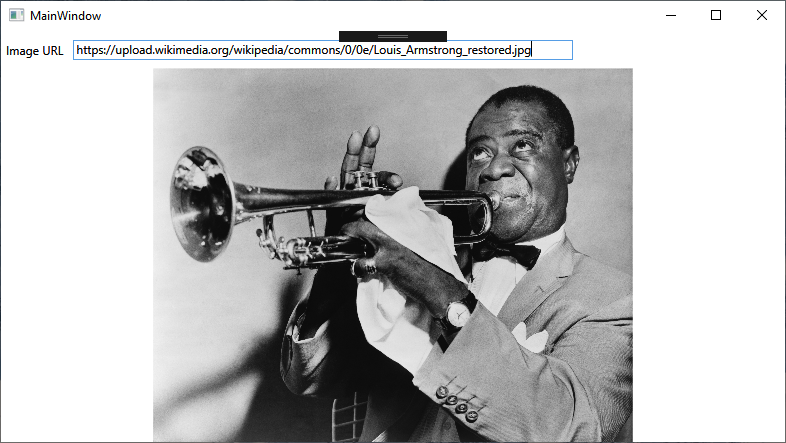

# Project 1: Displaying An Image From A URL

While the previous example was a basic implementation of MVVM, it's where many of the "simple" guides on MVVM stop. Other guides introduce things like Data Access Layers and ViewModel Locators very early on after demonstrating a basic implementation. Instead of diving way too far into the deep end, you'll build out several projects that introduce a few new features at a time and reinforce what you learned by building out the previous projects.

For this project, you'll create a small application that accepts a URL of an image and displays it using the Image element.

## Build Out The View

Any project will have requirements, even a project as simple as this one. What would you expect a user interface designed to take in a URL and output an image to require?

1. Somewhere to input the URL
2. Something that indicates what should be supplied as input
3. Something that displays the image

All of those things are already included in WPF. Load up a new WPF project called `ImageDisplay` and either implement the nodes on your own, or follow along below.

```xml
<Grid>
    <Grid.RowDefinitions>
        <RowDefinition Height="*"/>
        <RowDefinition Height="10*"/>
    </Grid.RowDefinitions>

    <!-- 
    The XAML nodes have several properties in them now, so you may want to make things a tad clearer by
    spacing them out on new lines rather than having them all on one line.
    -->
    <StackPanel Grid.Row="0" Orientation="Horizontal">
        <TextBlock
            Text="Image URL"
            HorizontalAlignment="Center"
            VerticalAlignment="Center"
            Margin="5"/>
        <TextBox
            Text=""
            Width="500"
            Height="20"
            Margin="5"/>
    </StackPanel>

    <Image Grid.Row="1" HorizontalAlignment="Center" VerticalAlignment="Center"/>
</Grid>
```

## Build Out The ViewModel

Next, make a folder called `ViewModel` and create a class in it that will become your viewmodel. If you don't remember exactly how to implement it, that's fine, it'll come with time. Remember from the requirements that you need to feed a URL to a textbox in our program, so the viewmodel will more than likely need a property to hold and monitor changes to the value in that textbox. Feel free to look back at the example you followed previously, and once you're done, check your work against the code below.

```csharp
public class ImageDisplayViewModel : INotifyPropertyChanged
{
    private string _imageUrl;

    public event PropertyChangedEventHandler PropertyChanged;

    public string ImageURL
    {
        get
        {
            return _imageUrl;
        }
        set
        {
            _imageUrl = value;
            OnPropertyChanged(nameof(ImageURL));
        }
    }

    public ImageDisplayViewModel()
    {

    }

    protected virtual void OnPropertyChanged([CallerMemberName] string propertyName = null)
    {
        PropertyChanged?.Invoke(this, new PropertyChangedEventArgs(propertyName));
    }
}
```

## Bring It All Together

Just like the previous example, you'll need to connect the View and VieWModel together. From the previous example, you know that you can create a XAML namespace that points to the `ViewModel` folder you created and a `Window.DataContext` node that links to the viewmodel class you created:

```xml
<!-- Truncated window node -->
<Window
xmlns:imageVM="clr-namespace:ImageDisplay.ViewModel"/>

<Window.DataContext>
    <imgVM:ImageDisplayVieWModel/>
</Window.DataContext>
```

However, it's also possible to do this from the codebehind file associated with the XAML. If you've developed with WinForms previously, you're used to doing all of your work here. With MVVM WPF, establishing the DataContext is one of a few rare cases where you will have any kind of code in the codebehind associated with the XAML. In the constructor of the codebehind, set the `DataContext` property to a new instance of the `ImageDisplayViewModel` and include the appropriate `using` statement for the ViewModel folder:

```csharp
using ImageDisplay.ViewModel;
using System.Windows;

namespace ImageDisplay
{
    /// <summary>
    /// Interaction logic for MainWindow.xaml
    /// </summary>
    public partial class MainWindow : Window
    {
        public MainWindow()
        {
            InitializeComponent();
            DataContext = new ImageDisplayViewModel();
        }
    }
}
```

Remember from the previous project that XAML nodes are directly linked to types specified in the CLR; everything you can create and modify in XAML can also be achieved via codebehind. You'll find conflicting opinions about whether or not it's *proper* MVVM to set the `DataContext` from codebehind, but you should know that setting the `DataContext` from codebehind *can* be done if need be. I recommend staying away from writing anything in the codebehind of your XAML unless you have some **incredibly** exceptional circumstance that calls for it. After setting your `DataContext`, hop on back to your view's XAML so you can set your bindings.

The cool thing about binding is that it's now possible to handle input as it happens, rather than having to write events in codebehind for every little interaction. For your `<TextBox>`, you can bind its `Text` property to the `ImageURL` property you created in the viewmodel. However, for that `ImageURL` property to update when you or your user places a URL in the textbox, you'll have to specify a trigger that will say, "Alright, it's time to update the `ImageURL` property!" Enter the `UpdateSourceTrigger` property available in WPF.

`UpdateSourceTrigger` is a property associated with binding that allows you to specify what kind of event will pass any updates from the view to the property or properties in your viewmodel. For the purpose of this project, you'll want to use the `PropertyChanged` value of the `UpdateSourceTrigger` property, as it will perform an update any time a change is detected. Your `<TextBox>`'s binding should look like this:

```xml
<TextBox
    Text="{Binding ImageURL, UpdateSourceTrigger=PropertyChanged}"
    Width="500"
    Height="20"
    Margin="5"/>
```

*A side note about `UpdateSourceTrigger=PropertyChanged` - since this value will cause the property to fire off an update event any time a change is detected, it can quickly and negatively impact the performance of your program. For a program as small as this one, you'll notice absolutely no performance hit. However, if you decide to make a larger program with lots of elements, bindings, views, etc. and use `UpdateSourceTrigger=PropertyChanged` for a good number of the bindings within, your program will start to chug if multiple values start updating at once because the update event will fire on **any** little change.*

Finally, it's no good to have an image URL but no way to display it. Fortunately, the `Source` property of the `<Image>` element accepts URLs as well as filepaths for where to find the image in question, so you can bind the `Source` property to the viewmodel's `ImageURL` property.

```xml
<Image Grid.Row="1" HorizontalAlignment="Center" VerticalAlignment="Center" Source="{Binding ImageURL}"/>
```

Build it (Ctrl + Shift + B or F6) to make sure there are no rogue spelling errors or missing semicolons and press F5 to run it in debug mode. If you don't have an image URL that you'd like to test, here's a picture of Louis Armstrong from his Wikipedia page: https://upload.wikimedia.org/wikipedia/commons/0/0e/Louis_Armstrong_restored.jpg

If all went well, you should be greeted by the soulful face of Ambassador Satch himself.

